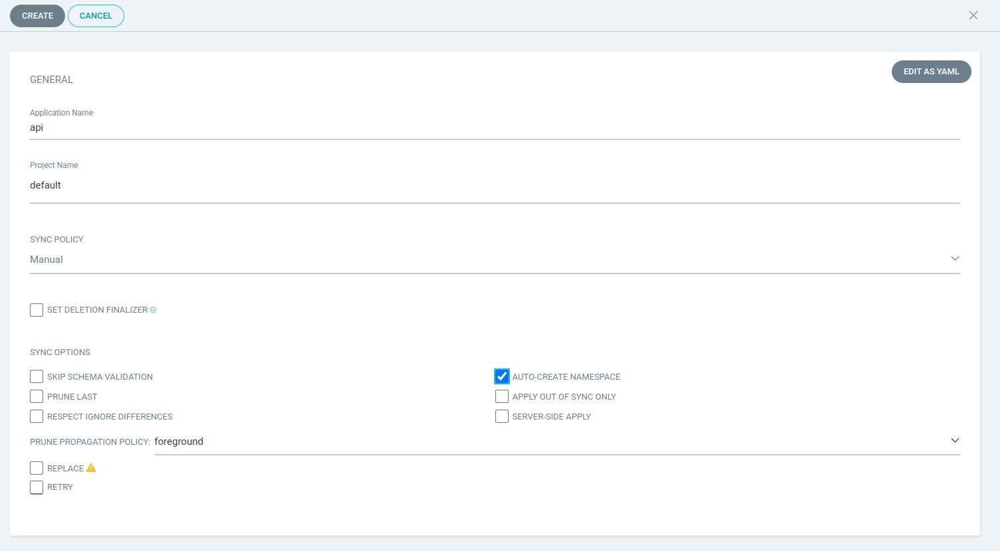
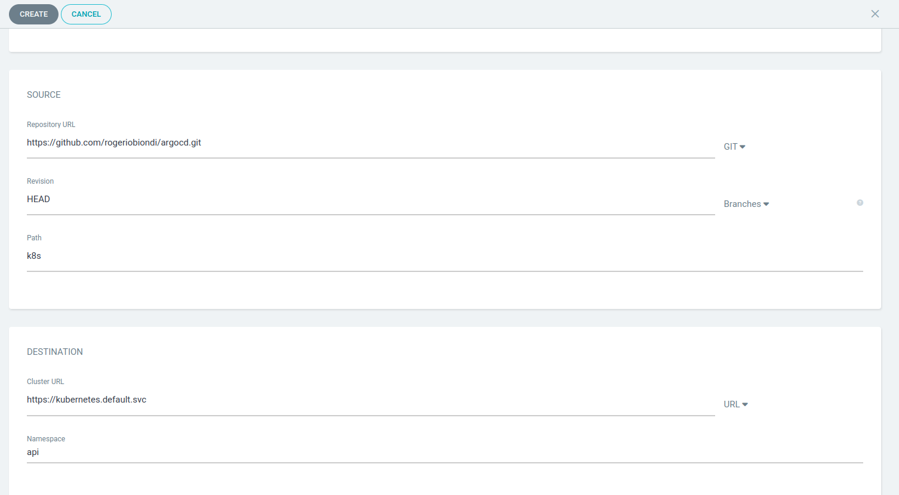
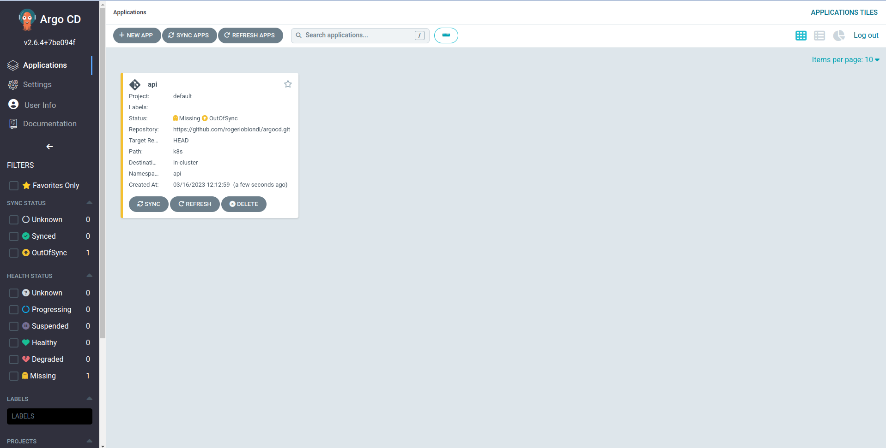

# argocd

ArgoCD continuous deployment sample using both K8s manifests and Helm Chart.
When the application is commited to the `main` branch, it will be built using the git hub actions and deployed to Kubernetes using ArgoCD.


# Pre reqs

- GNU Make (optional)

- Docker - https://docs.docker.com/

- Kubernetes Cluster: if you don't have, you may use a tool such Kind or Microk8s - https://microk8s.io/

- Kubectl - https://kubernetes.io/docs/tasks/tools/

- Kustomize - https://kustomize.io/

- Helm - https://helm.sh/docs/intro/install/


## Help

Make is not mandatory. You can open the `Makefile` and run each command yourself (good for learning)

```
make help

build                Run the api container image
clean                Reset project and clean containers
helm-create          Run the helm install in debug mode
helm-dry-run         Run the helm install in debug mode
helm-install         Deploy the application via helm
helm-uninstall       Undeploy the helm application
help                 Command help
install              Install dependencies
kube-create          Deploy manifest to Kubernetes
kube-delete          Undeploy from Kubernetes
kube-port-forward    Kubernetes Port forward
kustomize            Run the kustomize build
push                 Push image to docker hub
run                  Run the api
test                 Push image to docker hub
```

## Install ArgoCD

```
# Create namespace
kubectl create namespace argocd
# Apply manifest - wait a few seconds until complete
kubectl apply -n argocd -f https://raw.githubusercontent.com/argoproj/argo-cd/stable/manifests/install.yaml
```

Get the admin user credentials:

```
kubectl -n argocd get secret argocd-initial-admin-secret -o jsonpath="{.data.password}" | base64 -d
```

Port forward:

```
kubectl port-forward svc/argocd-server -n argocd 8080:443
```

Test the ArgoCD Console:

http://localhost:8080

user: admin
password: **provided earlier**


# Steps

## Test de API Locally

```
make run
```

go to the addresses to check if the image is working:

http://localhost:9000/
http://localhost:9000/items/1
http://localhost:9000/healthz
http://localhost:9000/docs


## Build Container Image

```
make build
```

## Push Image to Docker Hub

```
make push
```

## Test image locally (using docker)

```
make test
```

Check if the image is working:

http://localhost:9000/
http://localhost:9000/items/1
http://localhost:9000/healthz
http://localhost:9000/docs


## Test direct deployment to Kubernetes (using Manifests)

Deploy to kubernetes:

```
make kube-deploy
```

Port Forward to local TCP 9000:


```
make kube-port-forward
```

go to the addresses to check if the image is working:

http://localhost:9000/
http://localhost:9000/docs


## Clearance

Undeploy app from Kubernetes

```
make kube-delete
```

## Check github Actions

- Take a look at the git hub actions in directory `.github\workflows\deploy.yaml`
- Go to Settings -> Actions -> General
- Check the Workflow permissions `Read and write permissions`.


## Create argoCD app ## 

- Log into ArgoCD Console

- Click the + NEW APP Button




- Application Name: `api`
- Project Name: `default`
- Sync Policy: `Manual`
- Check the `Auto-Create Namespace` option
- Repository URL to `https://github.com/rogeriobiondi/argocd.git`
- Path: `k8s`
- Destination -> Cluster URL: `https://kubernetes.default.svc`
- Destination -> Namespace: `api`

Click `CREATE` button.



The app will be created and `OutOfSync`
- Click the `Sync` Button.
- Click the `Synchronize` Button.


# Helm Chart Deployment

## Create your helm charts

- create a helm chart using the following command:

```
make helm-create
```

- clean the `helm/templates` folder and copy your manifests there. Parametrize them.
- clean your values.yaml file
- clean your NOTES.txt file

## Testing your helm charts

```
helm install api helm --debug --dry-run
```

## Deploy the Helm Application

```
# Install the application
make helm-install

namespace/api created
NAME: helmapp
LAST DEPLOYED: Thu Mar 16 10:39:33 2023
NAMESPACE: default
STATUS: deployed
REVISION: 1
TEST SUITE: None
NOTES:
Deploy successful.

# Check if the application is installed
kubectl get all --namespace api
NAME                               READY   STATUS    RESTARTS   AGE
pod/helmapp-api-5d9575cb45-mjmhb   1/1     Running   0          14s
pod/helmapp-api-5d9575cb45-pql7q   1/1     Running   0          14s

NAME                      TYPE        CLUSTER-IP      EXTERNAL-IP   PORT(S)    AGE
service/helmapp-service   ClusterIP   10.152.183.95   <none>        9000/TCP   14s

NAME                          READY   UP-TO-DATE   AVAILABLE   AGE
deployment.apps/helmapp-api   2/2     2            2           14s

NAME                                     DESIRED   CURRENT   READY   AGE
replicaset.apps/helmapp-api-5d9575cb45   2         2         2       14s
```

Port forward:

```
kubectl port-forward service/helmapp-service -n api 9000:9000
```

Test:

http://localhost:9000/healthz


## Undeploy the Helm Application

```
# Uninstall the application
make helm-uninstall
```

## Create argoCD app ## 

- Log into ArgoCD Console

- Click the + NEW APP Button


- Application Name: `api`
- Project Name: `default`
- Sync Policy: `Manual`
- Check the `Auto-Create Namespace` option
- Repository URL to `https://github.com/rogeriobiondi/argocd.git`
- Path: `helm`
- Destination -> Cluster URL: `https://kubernetes.default.svc`
- Destination -> Namespace: `api`


Click `CREATE` button.


The app will be created and `OutOfSync`
- Click the `Sync` Button.
- Click the `Synchronize` Button.


